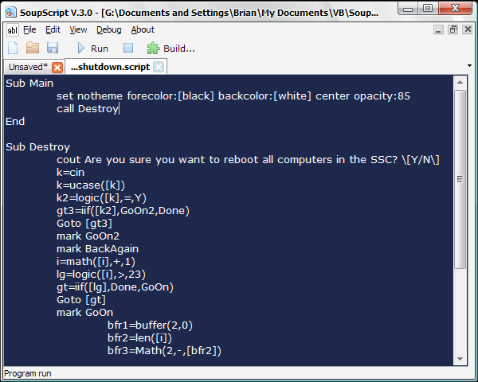



## SoupScript 3 \- intellisense, custom language, build programs and more

### Description

Build and run your own program. You have never seen the language before because I made it. Supports functions, custom functions, variables, several APIs, and some other custom functions which anyone may find useful.
 
### More Info
 
This program is for use by immature high school students. Online help is available, and the program may freeze for 15 seconds on its first run in order to update.

             |
---                |---
**Submitted On**   |2008-03-17 22:10:30
**By**             |[Brian Lai](https://github.com/Planet-Source-Code/PSCIndex/blob/master/ByAuthor/brian-lai.md)
**Level**          |Intermediate
**User Rating**    |5.0 (35 globes from 7 users)
**Compatibility**  |VB 6\.0
**Category**       |[Complete Applications](https://github.com/Planet-Source-Code/PSCIndex/blob/master/ByCategory/complete-applications__1-27.md)
**World**          |[Visual Basic](https://github.com/Planet-Source-Code/PSCIndex/blob/master/ByWorld/visual-basic.md)
**Archive File**   |[SoupScript2106513182008\.zip](https://github.com/Planet-Source-Code/brian-lai-soupscript-3-intellisense-custom-language-build-programs-and-more__1-70291/archive/master.zip)

### API Declarations

Tons, see code

